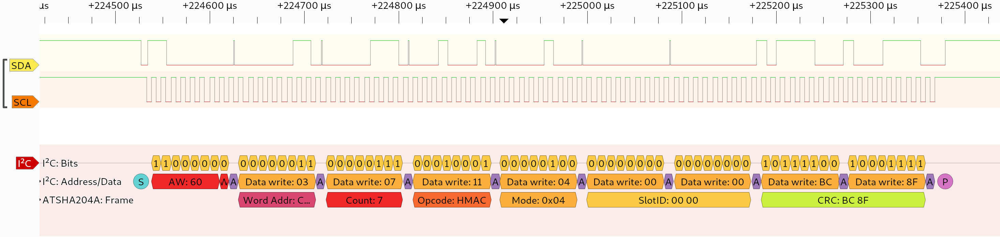

# ATSHA204A decoder for sigrok

Sigrok decoder for the ATSHA204A Microchip CryptoAuthentication module.

This decoder stacks on top of the I2C PD and decodes the packets of the
ATSHA204A.

For more information on sigrok visit: https://sigrok.org/

